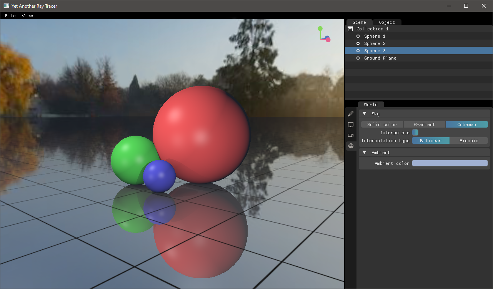

# Yet Another Ray Tracer 
*Yet Another Ray Tracer* (YART) is an open-source, 3D rendering application with an integrated ray tracing engine. 
Created for the author's bachelor's degree thesis in computer science, titled *"Implementation of a ray tracing engine using a CPU based renderer"*. 

This repository contains both [YART's source code](./src/) and the [dissertation's LaTeX project](./docs/).




## Description
YART is a cross-platform computer graphics software used for creating and rendering 3D scenes defined by Signed Distance Fields (SDFs) and triangle meshes. 
It consists of an interactive and responsive UI created on the GPU using [Vulkan] and custom [Dear ImGui] widgets, as well as the YART engine, which renders scenes on the CPU, using a traditional, object oriented
approach.

YART's source is well documented using Doxygen. 
The latest documentation can be found at the [project's GitHub Pages page](https://hhimko.github.io/yart/). Additionally, many of the algorithms and YART's inner-workings have been extensively described in the [YART thesis LaTeX project](./docs/).


## Dependencies
YART comes with most dependencies vendored-in as git submodules for convenience. 
These include [GLFW], [GLM] and [Dear ImGui]. 
The only exception is the [Vulkan SDK], which has to be downloaded manually for your target OS.


### Getting the Vulkan SDK
The latest version of the Vulkan development kit can be downloaded from the [official download page](https://vulkan.lunarg.com/sdk/home). 

YART by default will look for the SDK in `C:/VulkanSDK` and will link against the most recent version installed there.
If you wish to specify a custom search path or a specific SDK version, you can use the `VULKAN_SDK` and `VULKAN_VERSION` flags when compiling with cmake:

```shell
> cmake -S . -B build -DVULKAN_SDK=C:/Path/To/SDK -DVULKAN_VERSION=x.y.z.w
```


## Building YART From Source
YART uses [CMake] (version 3.13+) as its build system. 

  1. Clone the repo. Make sure to clone with flag `--recurse-submodules` to initialize submodules, or run ` git submodule update --init --recursive` after cloning:
  ```shell
  > git clone https://github.com/hhimko/yart.git --recurse-submodules
  > cd yart
  ``` 

  2. Install all required [dependencies],

  3. Build YART with CMake:
  ```shell
  > mkdir build
  > cmake -S . -B ./build 
  > cmake --build ./build --config Release --target yart
  ```


## License
YART is licensed under the #TODO license.

Author: Dawid Cyganek [@hhimko]


[Vulkan]: https://vulkan.lunarg.com/
[Dear ImGui]: https://github.com/ocornut/imgui.git
[GLFW]: https://github.com/glfw/glfw
[GLM]: https://github.com/g-truc/glm
[Vulkan SDK]: https://vulkan.lunarg.com/sdk/home
[CMake]: https://cmake.org/
[dependencies]: #dependencies
[@hhimko]: https://github.com/hhimko
